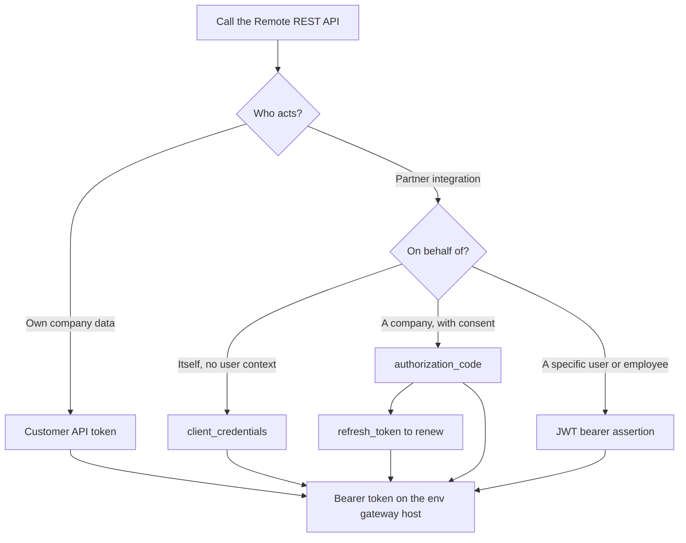

# Remote API Auth

Covers every credential and token-acquisition path for code that calls the Remote.com REST API: static customer tokens, and all four partner OAuth 2.0 flows.

## Invoke This Skill When

- Setting up Remote API access for the first time (customer or partner).
- Choosing between customer (API token) and partner (OAuth 2.0) auth.
- Implementing or refreshing any of the four partner flows: `client_credentials`, `authorization_code`, `refresh_token`, or JWT bearer assertion.
- Obtaining company consent (sending a company admin through the authorization_code flow).
- Selecting the right environment host for sandbox vs. production.
- Resolving a 401 or 403 response traced to auth or scopes.
- For the in-editor Remote MCP session, the host plugin handles OAuth — this skill is for tokens your own service uses.

## Prerequisites

**Customer integrations:**
- A Remote account with admin or owner permissions to generate an API token under Company Settings -> Integrations & APIs -> Remote API -> Generate API Token.

**Partner integrations:**
- A `CLIENT_ID` and `CLIENT_SECRET` issued by Remote.
- At least one registered redirect URI (required for the authorization_code flow).
- Start in the sandbox environment before going to production; see the Environments table below.

## Security & PII Constraints

| Rule | Detail |
|---|---|
| **No secrets in source** | Never commit `CLIENT_SECRET`, `access_token`, `refresh_token`, or API token values to source control, comments, test fixtures, or log lines. Use placeholders (`{{access_token}}`, `$CLIENT_SECRET`) in all code samples. |
| **Secret manager** | Store `CLIENT_ID`, `CLIENT_SECRET`, and all tokens in a secret manager (e.g. AWS Secrets Manager, HashiCorp Vault, GCP Secret Manager). Never read them from environment-variable files checked in to version control. |
| **CLIENT_SECRET sensitivity** | The `CLIENT_SECRET` also signs JWT bearer assertions — treat it with the same care as a private key. Rotate it immediately if it leaks. |
| **Scope minimally** | Tokens grant access to all data within their scopes. Request only the scopes the integration actually uses; see the per-endpoint Scopes table in `developer.remote.com/reference/<operationId>.md`. |
| **Sandbox first** | Always develop and test against the sandbox host. Never point exploratory or test calls at production data. |

## Workflow (Phases)

### Phase 1: Choose the Environment

Both environments use the same path conventions. The auth token endpoint and the REST API share the same gateway host. Customers and partners both use these hosts.

| Environment | Gateway host (REST + auth) | App host | Notes |
|---|---|---|---|
| Production | `https://gateway.remote.com` | `https://remote.com` | Customer `ra_live_` API tokens; partner OAuth tokens minted here. |
| Sandbox | `https://gateway.remote-sandbox.com` | `https://remote-sandbox.com` | Customer `ra_test_` API tokens; partner OAuth tokens minted here. |

Partners also have a sandbox at `https://gateway.partners.remote-sandbox.com` (a valid JWT `aud` value — see Phase 7).

Token endpoint: `POST {host}/auth/oauth2/token`
Authorize endpoint: `GET {host}/auth/oauth2/authorize`

**Critical:** tokens are environment-bound — a token works only on the gateway of the environment that issued it. For customer API tokens the prefix marks the environment class (`ra_live_` = production, `ra_test_` = sandbox); partner OAuth tokens work only on the host that minted them. A mismatched token returns 401.

### Phase 2: Customer Auth (Static API Token)

A company admin or owner generates a static bearer token in Remote Settings -> Integrations & APIs. No token exchange is required — use it directly as a bearer credential.

```bash
curl -s \
  -H "Authorization: Bearer ra_live_{{your_token}}" \
  -H "Content-Type: application/json" \
  "https://gateway.remote.com/v1/employments?page_size=1"
```

For sandbox, use `ra_test_{{your_token}}` against `https://gateway.remote-sandbox.com`.

Use a customer-accessible endpoint when verifying customer API tokens. `GET /v1/companies` is partner-only and requires a partner OAuth `client_credentials` token; a failed `/v1/companies` call does not prove a customer `ra_live_` / `ra_test_` token is invalid.

Success (200 — confirm exact envelope from the endpoint reference):

```json
{
  "data": {
    "employments": [
      { "id": "...", "status": "active" }
    ],
    "current_page": 1,
    "total_pages": 1,
    "total_count": 1
  }
}
```

Token/host mismatch or expired token (401):

```json
{ "message": "Unauthorized" }
```

The customer model is for direct company-owned integrations. Partner-only endpoints are not accessible with a customer API token.

### Phase 3: Partner Auth — Choose a Flow

| Situation | Flow |
|---|---|
| Integration acts on its own behalf (no user context needed) | `client_credentials` |
| Integration acts on behalf of a company (company consent required) | `authorization_code` (then `refresh_token` to renew) |
| Integration acts as a specific user or employee, with verified identity | JWT bearer assertion |



All partner token requests are:
- Method: `POST {host}/auth/oauth2/token`
- Content-Type: `application/x-www-form-urlencoded`
- Client authentication: HTTP Basic (`Authorization: Basic base64(client_id:client_secret)`) for `client_credentials`, `authorization_code`, and `refresh_token`. The **JWT bearer assertion** flow (Phase 7) is the exception: the client is authenticated by the signed assertion itself (`iss` = `CLIENT_ID`, signed with `CLIENT_SECRET`), so it sends **no** Basic header.

Do not send partner token requests as JSON — the token endpoint only accepts `application/x-www-form-urlencoded`.

### Phase 4: Partner Flow — client_credentials

Use when the integration acts as itself (no company or user delegation).

```bash
curl -s -X POST \
  -u "$CLIENT_ID:$CLIENT_SECRET" \
  -H "Content-Type: application/x-www-form-urlencoded" \
  --data-urlencode "grant_type=client_credentials" \
  "https://gateway.remote-sandbox.com/auth/oauth2/token"
```

Success (200):

```json
{
  "access_token": "{{access_token}}",
  "token_type": "Bearer",
  "expires_in": 3600
}
```

Note: `client_credentials` does not return a `refresh_token`. When the token expires (1 hour), request a new one using the same call.

Error (invalid credentials — confirm exact shape from authentication.md):

```json
{ "error": "invalid_client" }
```

### Phase 5: Partner Flow — authorization_code (Company Consent)

Use when the integration needs to act on behalf of a Remote company. Send the company admin to the authorize URL; on approval, exchange the returned code for tokens.

**Step 1 — Redirect the company admin:**

```
GET {host}/auth/oauth2/authorize
  ?client_id={CLIENT_ID}
  &redirect_uri={registered_redirect_uri}
  &state={csrf_token}
  &scope={space_separated_scopes}
```

Example URL-style scope: `https://gateway.remote.com/company.manage` (use verbatim even against sandbox — see Quick Reference for scope style details).

**Step 2 — Exchange the code (expires in 5 minutes):**

```bash
curl -s -X POST \
  -u "$CLIENT_ID:$CLIENT_SECRET" \
  -H "Content-Type: application/x-www-form-urlencoded" \
  --data-urlencode "grant_type=authorization_code" \
  --data-urlencode "code={{authorization_code}}" \
  "https://gateway.remote-sandbox.com/auth/oauth2/token"
```

Success (200):

```json
{
  "access_token": "{{access_token}}",
  "refresh_token": "{{refresh_token}}",
  "token_type": "Bearer",
  "expires_in": 3600,
  "company_id": "{{company_id}}",
  "user_id": "{{user_id}}"
}
```

Persist `company_id` and `user_id` from the response — they identify which company and admin completed consent. Eligible partners may also shortcut at company creation: `POST /eor/v1/companies?action=get_oauth_access_tokens`.

Company-creation shortcut success (200 — confirm exact envelope from the endpoint reference):

```json
{
  "data": {
    "company": {
      "id": "{{company_id}}",
      "name": "..."
    },
    "tokens": {
      "access_token": "{{access_token}}",
      "refresh_token": "{{refresh_token}}",
      "expires_in": 3600
    }
  }
}
```

Expired or already-used code (error — confirm exact shape from authentication.md):

```json
{ "error": "invalid_grant" }
```

### Phase 6: Partner Flow — refresh_token

Use to renew an `access_token` obtained via `authorization_code` before or shortly after it expires (every ~1 hour).

```bash
curl -s -X POST \
  -u "$CLIENT_ID:$CLIENT_SECRET" \
  -H "Content-Type: application/x-www-form-urlencoded" \
  --data-urlencode "grant_type=refresh_token" \
  --data-urlencode "refresh_token={{refresh_token}}" \
  "https://gateway.remote-sandbox.com/auth/oauth2/token"
```

Success (200):

```json
{
  "access_token": "{{access_token}}",
  "refresh_token": "{{refresh_token}}",
  "token_type": "Bearer",
  "expires_in": 3600
}
```

The returned `refresh_token` is the same value you sent (reusable, not rotated). The response does not include `company_id` or `user_id` — persist those from the original `authorization_code` exchange.

### Phase 7: Partner Flow — JWT Bearer Assertion

Use when acting as a specific user or employee (verified identity, no interactive redirect).

The JWT is signed HS256 using `CLIENT_SECRET` and must carry these claims:

| Claim | Value |
|---|---|
| `iss` | `CLIENT_ID` |
| `sub` | `urn:remote-api:company-manager:user:<user-id>` for a company manager, or `urn:remote-api:employee:employment:<employment-id>` for an employee |
| `aud` | The auth base URL (host + `/auth`), not the REST endpoint being called — and it must match the server you call. One of: `https://gateway.remote.com/auth` (production), `https://gateway.remote-sandbox.com/auth` (sandbox), or `https://gateway.partners.remote-sandbox.com/auth` (partner sandbox). |
| `exp` | Unix timestamp no more than 10 minutes in the future |
| `scope` | Space-separated `resource:action` scopes (optional; omitting grants all scopes) |

This flow sends **no** HTTP Basic header — unlike the other three partner flows, the signed assertion authenticates the client.

```bash
curl -s -X POST \
  -H "Content-Type: application/x-www-form-urlencoded" \
  --data-urlencode "grant_type=urn:ietf:params:oauth:grant-type:jwt-bearer" \
  --data-urlencode "assertion={{signed_jwt}}" \
  "https://gateway.remote-sandbox.com/auth/oauth2/token"
```

Success (200):

```json
{
  "access_token": "{{access_token}}",
  "token_type": "Bearer",
  "expires_in": 3600
}
```

Note: JWT bearer assertion does not return a `refresh_token`. Re-mint the JWT (new `exp`) and request a fresh token when needed.

Error (invalid or expired JWT — confirm exact shape from authentication.md):

```json
{ "error": "invalid_grant" }
```

### Phase 8: Use the Token

Once you have any access token, attach it as a bearer credential to every API call:

```bash
curl -s \
  -H "Authorization: Bearer {{access_token}}" \
  -H "Content-Type: application/json" \
  "https://gateway.remote-sandbox.com/v1/employments?page_size=1"
```

Choose a verification endpoint that matches the token type. Customer API tokens (`ra_live_` / `ra_test_`) and company-scoped partner tokens can call customer/company endpoints such as `/v1/employments`; `/v1/companies` lists companies that authorized a partner integration and is only for partner `client_credentials` tokens.

## Quick Reference

### Scope Styles

Two separate syntax styles exist depending on the flow:

| Flow | Style | Example |
|---|---|---|
| `authorization_code` / consent | URL-style — use verbatim even against sandbox | `https://gateway.remote.com/company.manage` |
| JWT bearer assertion | `resource:action` style, space-separated | `employment:read offboarding:write` |

The per-endpoint Scopes table in `developer.remote.com/reference/<operationId>.md` is the authoritative source for which scopes each endpoint requires. No full scope catalog is published as a standalone list.

Optional — if you have the public `remotecli` (github.com/remoteoss/remote-cli) installed: `remotecli login` (PKCE, sandbox) mints a working token quickly for exploratory use.

### Auth Errors

Standard OAuth 2.0 error codes on the token endpoint (`POST {host}/auth/oauth2/token`). Confirm exact response bodies from the token endpoint reference.

| Error / status | Typical cause | What to do |
|---|---|---|
| `invalid_client` | Wrong `CLIENT_ID`/`CLIENT_SECRET`, or missing/incorrect HTTP Basic header | Verify credentials; confirm Base64 encoding of `client_id:client_secret` |
| `invalid_grant` | Expired or already-used authorization `code`, invalid/expired JWT assertion, or bad `refresh_token` | Re-run authorization_code flow, re-mint JWT, or check stored refresh token |
| `invalid_request` | Missing required parameter (`grant_type`, `code`, `refresh_token`, `assertion`) | Inspect request body against the flow's required fields |
| `unsupported_grant_type` | Wrong `grant_type` value | Use `client_credentials`, `authorization_code`, `refresh_token`, or `urn:ietf:params:oauth:grant-type:jwt-bearer` |
| `invalid_scope` | Scope not recognized or not permitted for this client | Check the endpoint's Scopes table; use URL-style scopes for consent, `resource:action` for JWT |
| REST 401 | Missing/invalid token, or token/host environment mismatch | Verify bearer header; match token to gateway host (`ra_live_` = production, `ra_test_` = sandbox) |
| REST 403 | Token valid but insufficient scope for the endpoint | Re-mint token with required scope from the endpoint's reference page |

### Common pitfalls

**Mixing token and host environments.** A `ra_live_` customer token sent to sandbox, or `ra_test_` sent to production, returns 401 — and a partner OAuth token works only on the gateway that minted it. Always use a token on the gateway of the environment that issued it (`gateway.remote.com` for production, `gateway.remote-sandbox.com` for sandbox).

**Expecting a `refresh_token` from `client_credentials` or JWT assertion.** Only the `authorization_code` flow returns a `refresh_token`. The other two flows require you to re-request a fresh token directly when the current one expires.

**Sending token requests as JSON.** The token endpoint (`/auth/oauth2/token`) requires `Content-Type: application/x-www-form-urlencoded` and HTTP Basic client auth (except JWT assertion). Sending JSON or putting credentials in the body will fail.

**Letting the 5-minute authorization code expire.** The `code` from the authorization_code callback is valid for only 5 minutes. Exchange it immediately after the redirect; do not store it and exchange it later.

**Letting the JWT `exp` drift beyond 10 minutes.** The `exp` claim must be no more than 10 minutes in the future at the time of the token request. Generate the JWT immediately before the request; do not pre-generate and cache it.

**Using the wrong JWT `aud` value.** The `aud` claim must be the auth base URL with `/auth` suffix (e.g. `https://gateway.remote-sandbox.com/auth`), not the REST endpoint URL and not the gateway host without `/auth`.

**Letting access tokens lapse without proactive refresh.** Access tokens expire after 3600 seconds (1 hour). Cache the expiry time and refresh (or re-request) proactively — for example 5 minutes before the known expiry — rather than waiting for a 401.

**Using customer API token patterns for partner-only endpoints.** Customer API tokens (`ra_live_` / `ra_test_`) are for company-owned integrations. Partner-only endpoints require OAuth tokens obtained through one of the four partner flows.

**Verifying customer tokens against `/v1/companies`.** `GET /v1/companies` is a partner/client-credentials endpoint. To smoke-test a customer API token, call a customer-accessible endpoint such as `GET /v1/employments?page_size=1` instead.

**Assuming a published full scope catalog.** No exhaustive list of all scopes is published. The authoritative source for required scopes is the Scopes table on each endpoint's reference page at `developer.remote.com`.
